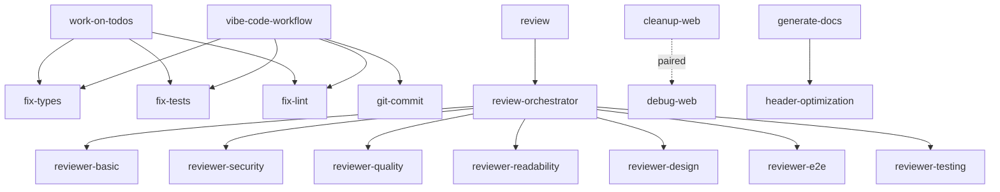

# Claude Code Commands Documentation

> Comprehensive command system for advanced development automation and code quality management

by: [Adam Manuel](https://github.com/AdamManuel-dev)

## 📚 Table of Contents

- [Overview](#overview)
- [Command Categories](#command-categories)
- [Command Reference](#command-reference)
- [Command Dependencies](#command-dependencies)
- [Quick Start Guide](#quick-start-guide)
- [Workflow Examples](#workflow-examples)
- [Architecture](#architecture)

## Overview

The Claude Code Commands system provides a sophisticated suite of development automation tools designed to enhance code quality, streamline workflows, and maintain high engineering standards. The system consists of 24 specialized commands organized into logical categories, with intelligent orchestration and dependency management.

### Key Features

- **Automated Quality Gates**: Systematic detection and resolution of code issues
- **Intelligent Code Review**: Multi-dimensional analysis with specialized reviewers
- **Workflow Automation**: Complete development lifecycle management
- **Documentation Generation**: Comprehensive inline and external documentation
- **Git Integration**: Smart commit, stash, and branch management
- **Session Management**: State preservation and workflow recovery

## Command Categories

### 🔧 Quality Commands
Automated detection and resolution of code quality issues

| Command | Purpose | Auto-Fix |
|---------|---------|----------|
| `/fix-tests` | Resolve failing tests systematically | ✅ |
| `/fix-lint` | Fix ESLint errors and warnings | ✅ |
| `/fix-types` | Resolve TypeScript type errors | ✅ |
| `/reviewer-basic` | Detect anti-patterns and common mistakes | ❌ |
| `/reviewer-quality` | Assess code quality and architecture | ❌ |
| `/reviewer-readability` | Evaluate code clarity and maintainability | ❌ |
| `/reviewer-security` | Identify security vulnerabilities | ❌ |

### 🔍 Review & Analysis Commands
Comprehensive code review and analysis systems

| Command | Purpose | Scope |
|---------|---------|-------|
| `/review` | Ultimate multi-dimensional review system | Full |
| `/review-orchestrator` | Coordinate multiple specialized reviewers | Full |
| `/ofri-pr-review` | Architecture-focused pull request review | PR |
| `/reviewer-design` | UI/UX and accessibility review | Frontend |
| `/reviewer-e2e` | End-to-end testing validation | Integration |
| `/reviewer-testing` | Test effectiveness and coverage analysis | Tests |

### 📝 Documentation Commands
Documentation generation and management

| Command | Purpose | Output |
|---------|---------|--------|
| `/generate-docs` | Generate comprehensive JSDoc and markdown | Files |
| `/header-optimization` | Add/update file header documentation | Headers |

### 🔄 Git Workflow Commands
Git operations and version control management

| Command | Purpose | Integration |
|---------|---------|-------------|
| `/git-commit` | Generate intelligent conventional commits | Quality Gates |
| `/git-stash` | Advanced stash with context preservation | Session Management |

### 🚀 Development Workflow Commands
Complete development lifecycle management

| Command | Purpose | Features |
|---------|---------|----------|
| `/vibe-code-workflow` | Complete development methodology | Auto-fix, Commit, Push |
| `/work-on-todos` | Systematic TODO implementation | Quality Gates |
| `/generate-todo-from-prd` | Convert PRD to actionable tasks | Task Generation |
| `/debug-web` | Strategic debug log insertion | Session Tracking |
| `/cleanup-web` | Remove debug artifacts | Paired with debug-web |

## Command Reference

### Core Commands

#### `/review [mode] [depth] [target]`
Ultimate review system combining all review methodologies

**Modes:**
- `quick` - Basic validation only (5 minutes)
- `standard` - Core quality review (15 minutes) [default]
- `comprehensive` - Full validation (30 minutes)
- `strategic` - Complete analysis with holistic review (60 minutes)

**Depth:**
- `surface` - Quick scan for obvious issues
- `normal` - Standard depth analysis [default]
- `deep` - Thorough investigation with root cause analysis

**Example:**
```bash
/review comprehensive deep ./src
```

#### `/vibe-code-workflow`
Complete development workflow with quality gates

**Features:**
- Automated type error resolution
- Test failure fixing
- Lint error correction
- Intelligent commit generation
- Remote push with validation

**Example:**
```bash
/vibe-code-workflow
# Runs: fix-types → fix-tests → fix-lint → commit → push
```

#### `/work-on-todos`
Systematic implementation of TODO comments

**Process:**
1. Scan codebase for TODO/FIXME comments
2. Categorize by priority and complexity
3. Implement fixes systematically
4. Run quality gates after each fix
5. Generate implementation report

**Example:**
```bash
/work-on-todos
# Processes all TODOs with automatic quality validation
```

### Quality Assurance Commands

#### `/fix-types`
Resolve TypeScript errors systematically

**Features:**
- Intelligent type inference
- Generic type resolution
- Interface generation
- Type assertion optimization

#### `/fix-tests`
Fix failing tests with root cause analysis

**Features:**
- Test failure categorization
- Mock generation/update
- Assertion correction
- Test isolation fixes

#### `/fix-lint`
Resolve ESLint errors and warnings

**Features:**
- Auto-fixable issue resolution
- Code style normalization
- Import optimization
- Dead code removal

### Review Specialist Commands

#### `/reviewer-security`
Security vulnerability detection and remediation

**Checks:**
- Authentication flaws
- Authorization issues
- Input validation gaps
- Sensitive data exposure
- Dependency vulnerabilities

#### `/reviewer-quality`
Code quality and architecture assessment

**Analysis:**
- Design patterns
- SOLID principles
- Code complexity
- Coupling and cohesion
- Technical debt

#### `/reviewer-testing`
Test effectiveness evaluation

**Metrics:**
- Coverage analysis
- Test quality assessment
- Mock appropriateness
- Edge case detection
- Integration test gaps

## Command Dependencies

### Dependency Graph



### Command Relationships

#### Orchestration Commands
- **`/vibe-code-workflow`**: Orchestrates quality commands and git operations
- **`/review-orchestrator`**: Coordinates multiple specialized reviewers
- **`/review`**: Meta-orchestrator for all review methodologies

#### Paired Commands
- **`/debug-web`** ↔ **`/cleanup-web`**: Debug insertion and removal
- **`/git-commit`** → **`/git-stash`**: Commit with stash recovery

#### Quality Chain
```
/work-on-todos → /fix-types → /fix-tests → /fix-lint → /git-commit
```

## Quick Start Guide

### 1. Initial Setup
```bash
# Run comprehensive review to understand codebase state
/review comprehensive

# Generate documentation for existing code
/generate-docs ./src
```

### 2. Development Workflow
```bash
# Start development session
/vibe-code-workflow

# Work on existing TODOs
/work-on-todos

# Debug specific issue
/debug-web
# ... investigate ...
/cleanup-web
```

### 3. Code Review
```bash
# Before committing
/review quick

# For pull requests
/ofri-pr-review

# Deep analysis
/review strategic deep
```

### 4. Git Operations
```bash
# Smart commit
/git-commit

# Stash with context
/git-stash "Working on feature X"
```

## Workflow Examples

### Example 1: Complete Feature Development
```bash
# 1. Generate TODOs from requirements
/generate-todo-from-prd "Add user authentication"

# 2. Implement TODOs systematically
/work-on-todos

# 3. Run complete workflow with quality gates
/vibe-code-workflow

# 4. Final review before PR
/review comprehensive
```

### Example 2: Bug Investigation and Fix
```bash
# 1. Add debug logging
/debug-web

# 2. Identify issue
# ... manual investigation ...

# 3. Clean up debug artifacts
/cleanup-web

# 4. Fix identified issues
/fix-types
/fix-tests

# 5. Commit with context
/git-commit "Fix authentication race condition"
```

### Example 3: Code Quality Improvement
```bash
# 1. Run security review
/reviewer-security

# 2. Fix critical issues
# ... manual fixes ...

# 3. Run quality review
/reviewer-quality

# 4. Apply automated fixes
/fix-lint

# 5. Validate improvements
/review standard
```

## Architecture

### System Design Principles

1. **Modularity**: Each command is self-contained with clear responsibilities
2. **Composability**: Commands can be combined for complex workflows
3. **Idempotency**: Commands can be run multiple times safely
4. **Progressive Enhancement**: Start simple, add complexity as needed
5. **Fail-Safe**: Graceful degradation and error recovery

### Command Structure

All commands follow a consistent structure:

```markdown
# Command Name

by: (Author)[GitHub URL]

<instructions>
  Primary objective and requirements
</instructions>

<context>
  Operating environment and constraints
</context>

<methodology>
  Execution strategy and phases
</methodology>

## Implementation Details
```

### Quality Gates

Commands implement a multi-layered quality gate system:

1. **Pre-validation**: Check preconditions
2. **Execution**: Apply changes systematically
3. **Post-validation**: Verify changes don't break functionality
4. **Rollback**: Undo changes if validation fails
5. **Reporting**: Generate comprehensive reports

### Session Management

Stateful commands support session management:

- **Session Creation**: Initialize tracking state
- **Progress Tracking**: Monitor execution progress
- **Context Preservation**: Save work-in-progress
- **Recovery**: Resume interrupted sessions
- **Cleanup**: Archive completed sessions

## Best Practices

### Command Selection
- Use orchestration commands for complete workflows
- Use specialized commands for targeted improvements
- Chain commands for complex operations
- Always run quality gates before committing

### Workflow Optimization
- Start with `/review` to understand current state
- Use `/work-on-todos` for systematic improvements
- Apply `/vibe-code-workflow` for complete development cycles
- Run specialized reviewers for deep analysis

### Quality Maintenance
- Run `/fix-types` after significant changes
- Use `/fix-tests` to maintain test suite health
- Apply `/fix-lint` for consistent code style
- Execute `/review` before pull requests

## Troubleshooting

### Common Issues

#### Commands Not Found
- Ensure all command files are in `/commands` directory
- Check file permissions
- Verify Claude CLI installation

#### Review Orchestrator Failures
- Verify reviewer files exist
- Check for missing dependencies
- Review error logs for specific failures

#### Quality Gate Failures
- Run individual fix commands separately
- Check for conflicting changes
- Review test environment setup

### Debug Mode

Enable verbose logging for troubleshooting:
```bash
# Add debug flag to commands
/review --debug comprehensive

# Check command logs
cat ~/.claude/logs/commands.log
```

## Contributing

To add new commands:

1. Create command file in `/commands` directory
2. Follow standard command structure
3. Document dependencies and relationships
4. Add to appropriate category
5. Update this README

## Version History

- **v2.0.0** - Consolidated review system with orchestration
- **v1.5.0** - Added quality gate automation
- **v1.0.0** - Initial command system release

---

*Generated with Claude Code Documentation System*
*Last Updated: 2025-08-22*