# Review Orchestrator - Automated Code Improvement System

A comprehensive code review and improvement system that runs multiple specialized AI reviewers in parallel, automatically applies fixes, and provides detailed reports.

**💡 Two Ways to Use:**
- **Instant**: Use `/review` slash command directly in Claude/Cursor (no setup required)
- **Global**: Install as system-wide command with `./install-review-orchestrator.sh`

## 🚀 Quick Start

### Option 1: Slash Command (Instant)
```
/review add                           # Basic validation before git add
/review commit                        # Quality check before git commit  
/review push                          # Full validation before git push
/review merge                         # Complete review before merge to main
```

### Option 2: Installation (Global Command)
```bash
# Clone or navigate to the Review Orchestrator directory
./install-review-orchestrator.sh
```

### Usage After Installation
```bash
# Git workflow integration:
review add                             # Before git add (basic validation)
review commit                          # Before git commit (quality check)
review push                            # Before git push (full validation)
review merge                           # Before merge to main (complete review)

# Short aliases:
ro add                                 # Quick basic validation
review commit                          # Quality check shortcut
```

## 🔍 What It Does

The Review Orchestrator runs **7 specialized reviewers** in parallel:

| Reviewer | Focus | What It Fixes |
|----------|-------|---------------|
| 🔵 **Quality** | Code patterns, TypeScript, logic | Missing types, logical errors, modern syntax |
| 🔴 **Security** | Vulnerabilities, auth, data protection | Hardcoded secrets, input validation, dependencies |
| 🟢 **Readability** | Naming, structure, documentation | Function names, code organization, comments |
| 🟣 **Design** | UI/UX, accessibility, visual consistency | Missing alt text, color contrast, responsive issues |
| 🟡 **Basic** | Anti-patterns, common mistakes | Console.logs, unused imports, magic numbers |
| 🧪 **Testing** | Test effectiveness, coverage, mocking | Over-mocking, missing tests, poor coverage |
| 🔵 **E2E** | Integration testing, user flows | API validation, user workflows, system integration |

## ✨ Key Features

### 🔄 Complete Improvement Cycle
Each reviewer follows this workflow:
1. **Review** - Analyze code using specialized criteria
2. **Fix** - Automatically apply improvements using file editing tools  
3. **Validate** - Re-check that fixes work and don't break anything
4. **Report** - Document what was fixed and what needs attention

### ⚡ Git-Workflow Aligned Stages
- **`add`**: Stage 1 only - Basic validation before staging files
- **`commit`**: Stages 1-2 - Quality check before committing
- **`push`**: Stages 1-3 - Full validation before pushing
- **`merge`**: All stages - Complete review before merging to main
- Automatically runs appropriate git command if all stages pass

```mermaid
graph TD
    A["🎯 Review Orchestrator Start"] --> B{Git Command?}
    
    B -->|add| C1["🟡 Stage 1: Basic Review"]
    C1 --> D1{Pass?}
    D1 -->|Yes| E1["✅ git add ."]
    D1 -->|No| F1["❌ Fix Issues First"]
    
    B -->|commit| C2["🟡 Stage 1: Basic Review"]
    C2 --> G2["🟢🔵🔴 Stage 2: Core Quality<br/>(3 Parallel)"]
    G2 --> D2{Pass?}
    D2 -->|Yes| E2["✅ git commit -m 'message'"]
    D2 -->|No| F2["❌ Fix Issues First"]
    
    B -->|push| C3["🟡🟢🔵🔴 Stages 1-2"]
    C3 --> G3["🟣🧪 Stage 3: Design & Testing<br/>(2 Parallel)"]
    G3 --> D3{Pass?}
    D3 -->|Yes| E3["✅ git push origin branch"]
    D3 -->|No| F3["❌ Fix Issues First"]
    
    B -->|merge| C4["🟡🟢🔵🔴🟣🧪 Stages 1-3"]
    C4 --> G4["🔵📝🔍 Stage 4: E2E & Merge Readiness<br/>(2 Parallel)"]
    G4 --> D4{Ready?}
    D4 -->|Yes| E4["🔔 Ready for Merge<br/>(Manual Approval)"]
    D4 -->|No| F4["❌ Not Ready for Main"]
```



### 🛡️ Smart Automation
- Only applies safe, functional fixes
- Conservative approach for complex changes
- Validates every fix before reporting
- Detailed before/after comparisons

### 📺 Real-Time Unified Dashboard
- **Consolidated View**: All reviewer outputs merged in real-time
- **Live Progress**: See status of all reviewers simultaneously
- **Cross-Reviewer Insights**: Issues found by multiple reviewers highlighted
- **Priority-Based Display**: Critical issues shown first across all domains

```mermaid
graph TB
    subgraph "🎯 Unified Dashboard"
        A["📊 Live Progress<br/>Stage 2/3 (66%)"]
        B["🔄 Reviewer Status Matrix<br/>✅ ⏳ ⏸️ States"]
        C["🔴 Critical Issues<br/>Cross-Reviewer Priority"]
        D["📈 Real-Time Metrics<br/>Files, Coverage, Fixes"]
    end
    
    subgraph "Stage 1"
        E1["🟡 Basic Review"] --> A
        E1 --> B
        E1 --> C
        E1 --> D
    end
    
    subgraph "Stage 2 (Parallel)"
        F1["🟢 Readability"] --> A
        F2["🔵 Quality"] --> A  
        F3["🔴 Security"] --> A
        F1 --> B
        F2 --> B
        F3 --> B
        F1 --> C
        F2 --> C
        F3 --> C
        F1 --> D
        F2 --> D
        F3 --> D
    end
    
    subgraph "Stage 3 (Parallel)"
        G1["🟣 Design"] --> A
        G2["🧪 Testing"] --> A
        G3["🔵 E2E"] --> A
        G1 --> B
        G2 --> B
        G3 --> B
        G1 --> C
        G2 --> C
        G3 --> C
        G1 --> D
        G2 --> D
        G3 --> D
    end
```



### 📊 Comprehensive Reporting
- Individual reports per reviewer
- Aggregated master report
- Metrics on files changed and issues resolved
- Prioritized remaining issues

## 💻 Installation Details

The installer sets up:
- Global `review` command
- Shell aliases: `ro`, `review` 
- Helper functions: `review-current`, `review-git-changed`
- Claude CLI integration (if available)
- PATH configuration in `.zshrc`/`.bashrc`

### Manual Installation
```bash
# Make executable
chmod +x install-review-orchestrator.sh

# Run installer
./install-review-orchestrator.sh

# Reload shell or restart terminal
source ~/.zshrc  # or ~/.bashrc
```

## 📖 Example Output

```bash
$ review src/

╔═══════════════════════════════════════════════════════════════╗
║                    Review Orchestrator                       ║
║              Automated Code Improvement System               ║
╚═══════════════════════════════════════════════════════════════╝

$ review push

[14:30:15] [ORCHESTRATOR] Push workflow: Running stages 1-3...
[14:30:30] [basic] Stage 1: Applied 5 critical fixes...
[14:30:45] [ORCHESTRATOR] Stage 1 passed - starting Stage 2 (3 parallel)...
[14:31:15] [security] Stage 2: Fixed 2 vulnerabilities...
[14:31:20] [quality] Stage 2: Fixed 4 TypeScript issues...
[14:31:25] [readability] Stage 2: Improved 8 naming issues...
[14:31:30] [ORCHESTRATOR] Stage 2 complete - starting Stage 3 (3 parallel)...
[14:31:45] [design] Stage 3: Fixed 3 accessibility issues...
[14:31:50] [testing] Stage 3: Improved coverage from 67% to 78%...

✅ All stages (1-3) passed! Executing: git push origin feature-branch
🚀 Code pushed successfully - ready for PR/merge

Push Review Summary:
───────────────────
basic: Fixed 5 critical issues ✅
quality: Fixed 4 TypeScript issues ✅
readability: Fixed 8 naming issues ✅
security: Fixed 2 vulnerabilities ✅
design: Fixed 3 accessibility issues ✅
testing: Coverage improved +11% ✅

🎯 Branch ready for merge review!
```

## 🛠️ Available Commands

### Slash Commands (Instant Use)
```
/review add                       # Basic validation before git add
/review commit                    # Quality check before git commit
/review push                      # Full validation before git push
/review merge                     # Complete review before merge to main
```

### Global Commands (After Installation)
```bash
# Main commands
review [directory]                 # Full review cycle
ro [directory]                     # Short alias  
review [directory]                 # Alternative alias

# Helper functions
review-current                     # Review current directory
review-git-changed                 # Review recently changed files
review-specific quality src/       # Run specific reviewer (future feature)
```

## 📁 Generated Files

```
./review-results/
├── quality_review_20240115_143022.md
├── security_review_20240115_143022.md
├── readability_review_20240115_143022.md
├── design_review_20240115_143022.md
├── basic_review_20240115_143022.md
├── e2e_review_20240115_143022.md
└── aggregated_review_20240115_143022.md  ← Master Report
```

## 🔧 Requirements

- **Claude CLI**: `npm install -g @anthropic-ai/claude-cli`
- **Shell**: bash/zsh with config file access
- **Git**: For change detection features
- **Node.js**: For Claude CLI functionality

## 🗑️ Uninstallation

```bash
# Remove global command and configuration
./uninstall-review-orchestrator.sh
```

This removes:
- Global command from `~/.local/bin/`
- Shell configuration from `.zshrc`/`.bashrc`
- Claude CLI integration
- Creates backup of shell config

## 🎯 Best Practices

1. **Run on clean branch** - Commit changes before running
2. **Review changes** - Always check `git diff` after running
3. **Test after fixes** - Ensure automated fixes don't break functionality
4. **Regular reviews** - Run weekly or before releases
5. **Team sharing** - Share aggregated reports with team

## 🚀 Integration

### CI/CD Pipeline
```yaml
- name: Automated Code Review
  run: |
    ./install-review-orchestrator.sh
    review src/
    # Upload review-results/ as artifacts
```

### Git Hooks
```bash
# pre-commit hook
#!/bin/bash
review-git-changed
if [ $? -ne 0 ]; then
  echo "Code review found issues. Please address them."
  exit 1
fi
```

## 📚 Documentation

- [⚡ Quick Reference](QUICK_REFERENCE.md) - Side-by-side comparison of both methods
- [📋 Complete Guide](commands/review-orchestrator.md) - Full implementation (slash command + global)
- [Detailed Usage Guide](commands/review-orchestrator-usage.md) - Global installation
- [Individual Reviewer Specs](commands/) - Specialized reviewer guidelines
- [Installation Guide](install-review-orchestrator.sh) - Global command setup

## 🤝 Contributing

To add new reviewers:
1. Create `commands/reviewer-newtype.md` following existing patterns
2. Add to `REVIEWERS` array in `review-orchestrator.sh`
3. Test with sample codebase

---

**Transform your codebase with automated, intelligent code improvement!** 🎯
