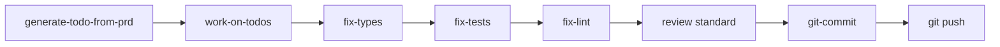
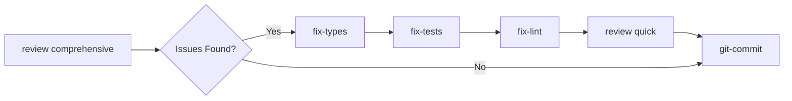
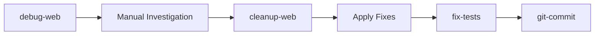
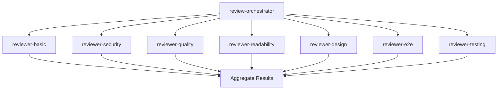

# Command Dependencies & Relationships

> Detailed mapping of command interdependencies and execution requirements

## 🔗 Dependency Matrix

### Core Dependencies

| Command | Direct Dependencies | Optional Dependencies | Conflicts With |
|---------|-------------------|----------------------|----------------|
| `/vibe-code-workflow` | fix-types, fix-tests, fix-lint, git-commit | git-stash | - |
| `/review` | review-orchestrator | All reviewer-* commands | - |
| `/review-orchestrator` | reviewer-basic, reviewer-security, reviewer-quality, reviewer-readability, reviewer-design, reviewer-e2e, reviewer-testing | - | - |
| `/work-on-todos` | - | fix-types, fix-tests, fix-lint | - |
| `/cleanup-web` | debug-web (paired) | - | - |
| `/debug-web` | - | cleanup-web (paired) | - |
| `/generate-docs` | - | header-optimization | - |
| `/git-commit` | - | fix-types, fix-tests, fix-lint | - |
| `/git-stash` | - | git-commit | - |

### Reviewer Dependencies

| Reviewer Command | Depends On | Triggers | Prerequisites |
|-----------------|------------|----------|---------------|
| `/reviewer-basic` | - | Code analysis | Source files exist |
| `/reviewer-security` | - | Security scan | Auth/API code present |
| `/reviewer-quality` | - | Architecture review | Project structure |
| `/reviewer-readability` | - | Clarity analysis | Source files |
| `/reviewer-design` | - | UI/UX review | Frontend code |
| `/reviewer-e2e` | - | Integration tests | Test files |
| `/reviewer-testing` | - | Test analysis | Test suite exists |

## 🔄 Execution Order

### Recommended Command Sequences

#### 1. Complete Development Cycle


#### 2. Quality Assurance Pipeline


#### 3. Debug Investigation Flow


#### 4. Review Orchestration


## 📦 Package Dependencies

### Required NPM Packages

Commands that require specific npm packages:

| Command | Required Packages | Optional Packages |
|---------|------------------|-------------------|
| `/fix-lint` | eslint, eslint-config-* | prettier, eslint-plugin-* |
| `/fix-types` | typescript | @types/* packages |
| `/fix-tests` | jest or mocha or vitest | @testing-library/*, enzyme |
| `/reviewer-design` | - | storybook, chromatic |
| `/reviewer-e2e` | - | cypress, playwright, puppeteer |

### System Requirements

| Command | System Requirements | Environment Variables |
|---------|-------------------|----------------------|
| All commands | Node.js 14+ | - |
| `/git-*` commands | Git 2.0+ | GIT_AUTHOR_*, GIT_COMMITTER_* |
| `/review-orchestrator` | zsh or bash | CLAUDE_CONFIG_DIR |
| `/vibe-code-workflow` | npm or yarn | NODE_ENV |

## 🔐 Permission Requirements

### File System Permissions

| Command | Read | Write | Execute |
|---------|------|-------|---------|
| `/review*` | ✅ | ❌ | ❌ |
| `/fix-*` | ✅ | ✅ | ❌ |
| `/git-*` | ✅ | ✅ | ✅ (git) |
| `/generate-docs` | ✅ | ✅ | ❌ |
| `/debug-web` | ✅ | ✅ | ❌ |
| `/cleanup-web` | ✅ | ✅ | ❌ |

## 🎯 Conditional Dependencies

### Context-Based Dependencies

Some commands have dependencies that activate based on context:

```javascript
// Conditional dependency logic
const conditionalDeps = {
  '/work-on-todos': {
    condition: 'todos_found',
    dependencies: {
      'typescript_todos': ['/fix-types'],
      'test_todos': ['/fix-tests'],
      'lint_todos': ['/fix-lint'],
      'security_todos': ['/reviewer-security']
    }
  },
  '/git-commit': {
    condition: 'pre_commit_checks',
    dependencies: {
      'typescript_errors': ['/fix-types'],
      'test_failures': ['/fix-tests'],
      'lint_errors': ['/fix-lint']
    }
  },
  '/vibe-code-workflow': {
    condition: 'project_type',
    dependencies: {
      'typescript': ['/fix-types'],
      'javascript': ['/fix-lint'],
      'has_tests': ['/fix-tests']
    }
  }
};
```

## 🔄 Circular Dependency Prevention

### Dependency Rules

1. **No Self-Dependencies**: Commands cannot depend on themselves
2. **No Circular Chains**: A → B → C → A is prohibited
3. **Maximum Chain Length**: 5 commands deep
4. **Escape Hatches**: All chains must have exit conditions

### Validation Script

```bash
#!/bin/bash
# validate-dependencies.sh

check_circular_deps() {
    local command=$1
    local visited=("$@")
    
    # Check if command was already visited (circular dependency)
    for v in "${visited[@]:1}"; do
        if [[ "$v" == "$command" ]]; then
            echo "❌ Circular dependency detected: ${visited[@]} -> $command"
            return 1
        fi
    done
    
    # Recursively check dependencies
    local deps=$(get_command_deps "$command")
    for dep in $deps; do
        check_circular_deps "$dep" "${visited[@]}"
    done
}

# Validate all commands
for cmd in /commands/*.md; do
    check_circular_deps "$(basename $cmd .md)"
done
```

## 🔀 Parallel Execution

### Commands Safe for Parallel Execution

| Parallel Group | Commands | Max Concurrent |
|----------------|----------|----------------|
| Reviewers | All `/reviewer-*` commands | 7 |
| Readers | `/review`, `/generate-docs` analysis phase | Unlimited |
| Fixers | `/fix-types`, `/fix-lint` | 2 |

### Commands Requiring Serial Execution

| Serial Chain | Reason |
|--------------|--------|
| `fix-types` → `fix-tests` | Type fixes may affect test compilation |
| `debug-web` → `cleanup-web` | Paired operation |
| `any-fix` → `git-commit` | Commit after fixes complete |

## 📊 Dependency Resolution Algorithm

```typescript
interface DependencyResolver {
  resolve(command: string): CommandExecutionPlan;
}

class CommandDependencyResolver implements DependencyResolver {
  private dependencies = new Map<string, string[]>();
  
  resolve(command: string): CommandExecutionPlan {
    const plan: CommandExecutionPlan = {
      phases: [],
      parallelGroups: [],
      serialChains: []
    };
    
    // Phase 1: Collect all dependencies
    const allDeps = this.collectDependencies(command);
    
    // Phase 2: Topological sort
    const sorted = this.topologicalSort(allDeps);
    
    // Phase 3: Identify parallel opportunities
    const parallel = this.identifyParallel(sorted);
    
    // Phase 4: Build execution plan
    return this.buildPlan(sorted, parallel);
  }
  
  private collectDependencies(command: string, visited = new Set()): string[] {
    if (visited.has(command)) return [];
    visited.add(command);
    
    const deps = this.dependencies.get(command) || [];
    const transitive = deps.flatMap(dep => 
      this.collectDependencies(dep, visited)
    );
    
    return [...deps, ...transitive];
  }
  
  private topologicalSort(deps: string[]): string[] {
    // Kahn's algorithm implementation
    return deps; // Simplified
  }
  
  private identifyParallel(sorted: string[]): string[][] {
    // Group commands that can run in parallel
    return []; // Simplified
  }
  
  private buildPlan(sorted: string[], parallel: string[][]): CommandExecutionPlan {
    // Build final execution plan
    return { phases: [], parallelGroups: parallel, serialChains: [[]] };
  }
}
```

## 🚨 Dependency Conflicts

### Known Conflicts

| Command A | Command B | Conflict Type | Resolution |
|-----------|-----------|---------------|------------|
| `/debug-web` | Any `/fix-*` | File modification | Run debug-web first |
| `/git-stash` | `/git-commit` | Git state | Complete one before other |
| Multiple `/fix-*` | Same file | Race condition | Serial execution |

### Conflict Resolution Strategy

1. **Detection**: Check for conflicts before execution
2. **Prevention**: Use locking mechanism for shared resources
3. **Resolution**: Apply predetermined resolution rules
4. **Rollback**: Restore state if conflicts cannot be resolved

## 📝 Dependency Documentation Standards

### Command File Requirements

Every command file must document:

```markdown
## Dependencies
- **Required**: [command1, command2]
- **Optional**: [command3, command4]
- **Conflicts**: [command5]
- **Prerequisites**: [system requirements]

## Integration Points
- **Triggers**: [downstream commands]
- **Triggered By**: [upstream commands]
- **Parallel Safe**: Yes/No
- **Idempotent**: Yes/No
```

## 🔍 Dependency Troubleshooting

### Common Issues

1. **Missing Dependency**
   - Error: "Command X requires Y but Y not found"
   - Solution: Install missing command or update dependency

2. **Version Mismatch**
   - Error: "Command X requires Y version 2.0+"
   - Solution: Update dependent command

3. **Circular Dependency**
   - Error: "Circular dependency detected: A → B → A"
   - Solution: Refactor command chain

4. **Resource Lock**
   - Error: "Cannot acquire lock for resource"
   - Solution: Wait for other command to complete

### Debug Commands

```bash
# Show dependency tree
claude deps --tree /vibe-code-workflow

# Validate all dependencies
claude deps --validate

# Check for circular dependencies
claude deps --check-circular

# Show execution plan
claude deps --plan /review-orchestrator
```

---

*Dependency documentation ensures reliable command execution and clear understanding of system interactions*
*Last Updated: 2025-08-22*